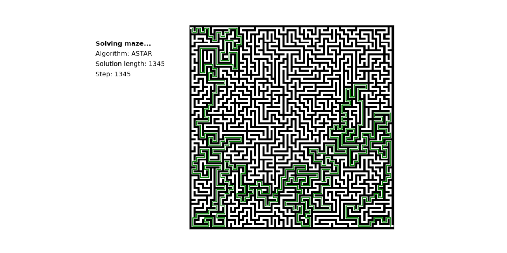

# Maze generation and solving

This repository contains a Python script for generating random mazes using the Recursive Backtracking algorithm and solving them using one of four different path finding algorithms: BFS, DFS, A*, and Dijkstra. The script visualizes the maze and animates the solution path using Matplotlib.

## Features

- Random maze generation using the Recursive Backtracking algorithm
- Path finding algorithms:
  - Breadth-First Search (BFS)
  - Depth-First Search (DFS)
  - A* Search
  - Dijkstra's algorithm
- Visualization of the maze and animated solution path
- Customizable maze dimension and path finding algorithm via command-line arguments

## License

This code is licensed under the MIT license found in the LICENSE file in the root directory of this source tree.

## Usage

To run the script, ensure that Python is installed on your computer along with the required dependencies. Execute the script from the command line with the desired arguments.

### Command-line arguments

`--algorithm` or `-a`: Path finding algorithm to use (choices: 'bfs', 'dfs', 'astar', 'dijkstra', default: 'bfs')
`--dimension` or `-d`: Dimension of the maze (default: 50)

### Example usage

```console
python generate_and_solve_maze.py --algorithm astar --dimension 30
```

## Output

The script will generate a random maze of the specified dimension, solve it using the selected path finding algorithm, and display an animated visualization of the maze and the solution path.

The solution path will be colored based on the selected algorithm:
- BFS: Red
- DFS: Blue
- A*: Green
- Dijkstra: Orange

## Installation

To run the script, you need to have Python installed on your computer along with the required dependencies.
Clone this repository or download the script file and execute it from the command line with the desired arguments.
